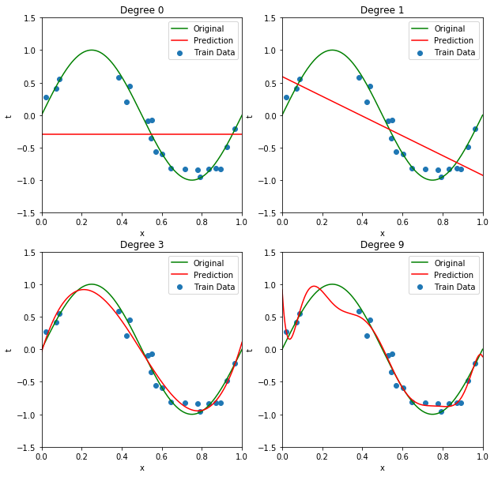
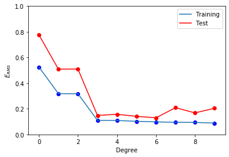
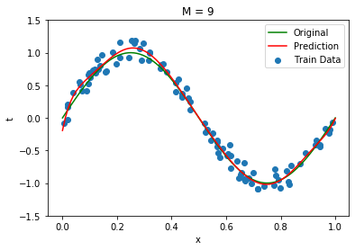
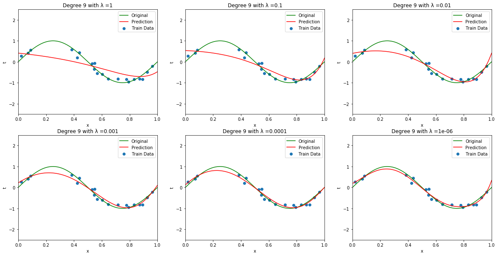
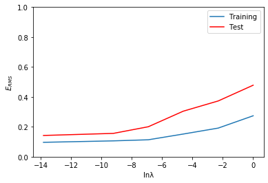

#   <span style ="text-align: center">Concept of Overfitting using Polynomial Regression </span>


### Libraries Used


```python
import numpy as np
import sklearn
from sklearn.metrics import mean_squared_error
from sklearn.model_selection import train_test_split
from sklearn.linear_model import LinearRegression
from sklearn.preprocessing import PolynomialFeatures
import matplotlib.pyplot as plt
from sklearn.linear_model import Ridge
import pandas as pd
import math
```

### Method that generates datapairs (X,y) using y = sin(2*pi*X) + N


```python
def generateTrainandTestData(num_of_rands, split_size):
    np.random.seed(0)
    X = np.sort(np.random.uniform(size = num_of_rands))
    y = np.sin(2*np.pi*X) + np.random.normal(size = num_of_rands)*0.1
    return X, y 
```

### Method that returns coefficients , Train and Test Predictions based on Regularization parameter


```python
def getCoefficients(degree_of_poly,X_train, X_test, y_train, y_test, regularization, lamda_val=0):
    if regularization is False:
        linear_reg = LinearRegression()
        poly_spec_deg = PolynomialFeatures(degree_of_poly)
        X_poly_spec_deg = poly_spec_deg.fit_transform(X_train.reshape(-1,1))
        deg_spec_deg_fit = linear_reg.fit(X_poly_spec_deg,y_train)
        train_y_prediction = linear_reg.predict(X_poly_spec_deg)
        test_y_prediction = linear_reg.predict(poly_spec_deg.fit_transform(X_test.reshape(-1,1)))
        return deg_spec_deg_fit.coef_.tolist(),train_y_prediction,test_y_prediction
    else:
        ridge_reg = Ridge(alpha = lamda_val / 2)
        poly_spec_deg = PolynomialFeatures(degree_of_poly)
        X_poly_spec_deg = poly_spec_deg.fit_transform(X_train.reshape(-1,1))
        deg_spec_deg_fit = ridge_reg.fit(X_poly_spec_deg,y_train)
        train_y_prediction_reg = ridge_reg.predict(X_poly_spec_deg)
        test_y_prediction_reg = ridge_reg.predict(poly_spec_deg.fit_transform(X_test.reshape(-1,1)))
        return deg_spec_deg_fit.coef_.tolist(),train_y_prediction_reg,test_y_prediction_reg
        
```

### Method that returns list of coefficients, Train and Test prediction lists for every degree from 0 to 9


```python
def getPredictandCoeffcientList(degree, X_train, X_test, y_train, y_test, reg, lamda_val=0):
    coef_list = []
    train_pred_list = []
    test_pred_list = []
    reg = reg
    lamda_val = lamda_val
    for i in range(degree+1):
        coefficients, train_predicition, test_predicition = getCoefficients(i,X_train, X_test, y_train, y_test,reg, lamda_val )
        coef_list.append(coefficients)
        train_pred_list.append(train_predicition)
        test_pred_list.append(test_predicition)
    return coef_list, train_pred_list, test_pred_list
```

### Generating 20 datapairs of (X,y) using y = sin(2*pi*X) + N


```python
X,y = generateTrainandTestData(20,0.5)
X_test = np.linspace(0,1,200)
y_test = np.sin(2*np.pi*X_test) + np.random.normal(size = 200)*0.1
coeffcient_list, train_pred_list, test_pred_list  = getPredictandCoeffcientList(9, X, X_test, y, y_test, False)
```

### Getting the Coefficients for degrees 0,1,3,9 and displaying them in the table


```python
degree_list = [0,1,3,9]
weights = {'Weights': ['W0','W1','W2','W3','W4','W5','W6','W7','W8','W9']}
df_weights = pd.DataFrame({'Weights': ['W0','W1','W2','W3','W4','W5','W6','W7','W8','W9']})
df_weights['M=9'] =  pd.Series(coeffcient_list[9])
df_weights['M=3'] =  pd.Series(coeffcient_list[3])
df_weights['M=1'] =  pd.Series(coeffcient_list[1])
df_weights['M=0'] =  pd.Series(coeffcient_list[0])
df_weights.set_index('Weights', inplace = True)
df_weights = df_weights[df_weights.columns[::-1]]
df_weights
```


<div>
<style scoped>
    .dataframe tbody tr th:only-of-type {
        vertical-align: middle;
    }

    .dataframe tbody tr th {
        vertical-align: top;
    }
    
    .dataframe thead th {
        text-align: right;
    }
</style>
<table border="1" class="dataframe">
  <thead>
    <tr style="text-align: right;">
      <th></th>
      <th>M=0</th>
      <th>M=1</th>
      <th>M=3</th>
      <th>M=9</th>
    </tr>
    <tr>
      <th>Weights</th>
      <th></th>
      <th></th>
      <th></th>
      <th></th>
    </tr>
  </thead>
  <tbody>
    <tr>
      <th>W0</th>
      <td>0.0</td>
      <td>0.000000</td>
      <td>0.000000</td>
      <td>0.000000</td>
    </tr>
    <tr>
      <th>W1</th>
      <td>NaN</td>
      <td>-1.517171</td>
      <td>9.990440</td>
      <td>-50.005249</td>
    </tr>
    <tr>
      <th>W2</th>
      <td>NaN</td>
      <td>NaN</td>
      <td>-30.102655</td>
      <td>1091.140726</td>
    </tr>
    <tr>
      <th>W3</th>
      <td>NaN</td>
      <td>NaN</td>
      <td>20.261047</td>
      <td>-9420.564465</td>
    </tr>
    <tr>
      <th>W4</th>
      <td>NaN</td>
      <td>NaN</td>
      <td>NaN</td>
      <td>42463.395178</td>
    </tr>
    <tr>
      <th>W5</th>
      <td>NaN</td>
      <td>NaN</td>
      <td>NaN</td>
      <td>-111016.487679</td>
    </tr>
    <tr>
      <th>W6</th>
      <td>NaN</td>
      <td>NaN</td>
      <td>NaN</td>
      <td>174183.119988</td>
    </tr>
    <tr>
      <th>W7</th>
      <td>NaN</td>
      <td>NaN</td>
      <td>NaN</td>
      <td>-161661.177985</td>
    </tr>
    <tr>
      <th>W8</th>
      <td>NaN</td>
      <td>NaN</td>
      <td>NaN</td>
      <td>81805.254111</td>
    </tr>
    <tr>
      <th>W9</th>
      <td>NaN</td>
      <td>NaN</td>
      <td>NaN</td>
      <td>-17395.703099</td>
    </tr>
  </tbody>
</table>
</div>


# Drawing a Chart of Fit data
> 1. In the figure with Degree 0, the Data is more than the model complexity so it is Underfitting
> 2. In the figure with Degree 9, the Data is less than the model complexity so it is Overfitting
> 3. In the figure with Degree 3, the model is correctly approximating the Data without over or under Fitting


```python
degree_list = [0,1,3,9]
plt.figure(figsize=(10, 10))
for i in range(len(degree_list)):
    plt.subplot(2, int(len(degree_list)/2), i + 1)
    plt.ylim([-1.5,1.5])
    plt.xlim((0,1))
    plt.plot(X_test, np.sin(2*np.pi*X_test),'g', label = 'Original')
    plt.scatter(X, y, label = 'Train Data')
    plt.plot(X_test,test_pred_list[degree_list[i]], 'r', label = 'Prediction')
    plt.xlabel('x')
    plt.ylabel('t')
    plt.title('Degree {}'.format(degree_list[i]))
    plt.legend(loc = "best")
```





## Calculating Train and Test errors for all degrees from 0 to 9


```python
train_error = []
test_error = []
for i in range(len(train_pred_list)):
    train_error.append([i, np.sqrt(mean_squared_error(train_pred_list[i], y))])
    test_error.append([i, np.sqrt(mean_squared_error(test_pred_list[i], y_test))])
    
```

### Converting them np array for slicing and plotting purpose  


```python
train_error_arr = np.asarray(train_error)
test_error_arr = np.asarray(test_error)
```

# Plotting Train error vs Test Error w.r.t Degrees


```python
plt.ylim([0,1])
plt.plot(train_error_arr[:,0], train_error_arr[:,1], label = 'Training')
plt.plot(test_error_arr[:,0], test_error_arr[:,1],'r', label= 'Test')
plt.scatter(test_error_arr[:,0],test_error_arr[:,1], marker = 'o', color='red')
plt.scatter(train_error_arr[:,0],train_error_arr[:,1], marker = 'o', color='blue')
plt.xlabel('Degree')
plt.ylabel(r'$E_{RMS}$')
plt.legend()
```


    <matplotlib.legend.Legend at 0x273e2e51408>





* In the above graph we can see that the train performance is increasing as the degree is getting increased. This is because the complex model is trying to overfit the data
* But if we see the test performance it is getting increased. This the classic example of Overfitting 

## Generating 100 more datapairs of (X,y) using y = sin(2*pi*X) + N 


```python
X_100,y_100 = generateTrainandTestData(100,0.1)
X_test_10 = np.linspace(0,1,100)
y_test_10 = np.sin(2*np.pi*X_test_10) + np.random.normal(size = 100)*0.1
coeffcient_list_100, train_pred_list_100, test_pred_list_100  = getPredictandCoeffcientList(9, X_100, X_test_10, y_100, y_test_10, False)
```

## Fitting the data with 9th order model and Plotting the Fit

> 1. We can observe that in the above graph with 9th order model we have data less than model complexity so it is overfitting
> 2. To avoid Overfitting we can 
> > 1. Use more data
> > 2. Apply Regularization
>
> 3. Here we have used more data and we can see that the model is approximating quite well


```python
plt.ylim([-1.5,1.5])
plt.plot(X_test_10, np.sin(2*np.pi*X_test_10),'g', label = 'Original')
plt.scatter(X_100, y_100, label = 'Train Data')
plt.plot(X_test_10,test_pred_list_100[9], 'r', label = 'Prediction')
plt.xlabel('x')
plt.ylabel('t')
plt.title('M = 9')
plt.legend()
```


    <matplotlib.legend.Legend at 0x273e2c48b48>





# Regularization

## Here we are generating Data Points again to apply Regularization


```python
X_reg,y_reg = generateTrainandTestData(20,0.5)
X_test_reg = np.linspace(0,1,200)
y_test_reg = np.sin(2*np.pi*X_test_reg) + np.random.normal(size = 200)*0.1
```

## Here We get Train and Test predictions based on a range of lambda values [1, 0.1, 0.01, 0.001, 0.0001, 0.000001]
> 1. Lamda Values are used so that the weights will not explode and they get penalized


```python
lamda_vals = [1, 0.1, 0.01, 0.001, 0.0001, 0.000001]
test_preds_for_lamdavals = []
train_preds_for_lamdavals = []
for i in range(len(lamda_vals)):
    _, train_pred_reg, test_pred_reg = getPredictandCoeffcientList(9, X_reg, X_test_reg, y_reg, y_test_reg, True, lamda_vals[i])
    train_preds_for_lamdavals.append(train_pred_reg)
    test_preds_for_lamdavals.append(test_pred_reg)

```

## Plotting the predictions with various lamda values for 9th order model


```python
plt.figure(figsize=(20, 10))
for i in range(len(lamda_vals)):
    plt.subplot(2, int(len(lamda_vals)/2), i + 1)
    plt.ylim([-2.5,2.5])
    plt.xlim((0,1))
    plt.plot(X_test_reg, np.sin(2*np.pi*X_test_reg),'g', label = 'Original')
    plt.scatter(X_reg, y_reg, label = 'Train Data')
    plt.plot(X_test_reg,test_preds_for_lamdavals[i][9], 'r', label = 'Prediction')
    plt.xlabel('x')
    plt.ylabel('t')
    plt.title('Degree {} with λ ={}'.format(9, lamda_vals[i]))
    plt.legend(loc = "best")

```





## Calculating Train and Test errors 


```python
train_error_reg = []
test_error_reg = []
for i in range(len(lamda_vals)):
    train_error_reg.append([np.log(lamda_vals[i]), np.sqrt(mean_squared_error(train_preds_for_lamdavals[i][9],y_reg))])
    test_error_reg.append([np.log(lamda_vals[i]), np.sqrt(mean_squared_error(test_preds_for_lamdavals[i][9], y_test_reg))])
    
```


```python
train_error_reg_arr = np.asarray(train_error_reg)
test_error_reg_arr = np.asarray(test_error_reg)
```

# Plotting Train error vs Test Error w.r.t lnλ values


```python
plt.ylim([0,1])
plt.plot(train_error_reg_arr[:,0], train_error_reg_arr[:,1], label = 'Training')
plt.plot(test_error_reg_arr[:,0], test_error_reg_arr[:,1],'r', label= 'Test')
plt.xlabel('lnλ')
plt.ylabel(r'$E_{RMS}$')
plt.legend()
```


    <matplotlib.legend.Legend at 0x273e32bcd88>





# Conclusion

* Regularizing the weights will help the model to approximate the data well, but if we regularize the model too much, that means if we penalize the weights too much the model will not be able to learn as the lamda value is too high.
* If we do not  Regularize the model then the weights will explode and the model will overfit the data. 
* So based on my test set performance my model is 9th order model with λ = 0.001

# References
> https://towardsdatascience.com/polynomial-regression-bbe8b9d97491

> https://stackoverflow.com/questions/12957801/matplotlib-placement-of-text-e-g-suptitle-inside-the-frame

> https://scikit-learn.org/stable/auto_examples/model_selection/plot_underfitting_overfitting.html

> https://towardsdatascience.com/machine-learning-polynomial-regression-with-python-5328e4e8a386

> https://scikit-learn.org/stable/modules/generated/sklearn.model_selection.train_test_split.html

> https://scikit-learn.org/stable/modules/generated/sklearn.metrics.mean_squared_error.html

> https://scikit-learn.org/0.15/auto_examples/plot_underfitting_overfitting.html

> https://scikit-learn.org/stable/modules/generated/sklearn.linear_model.Ridge.html
