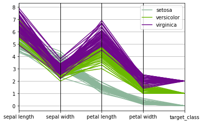
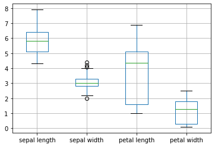
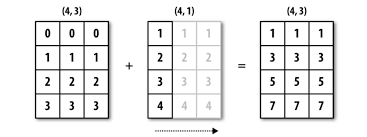
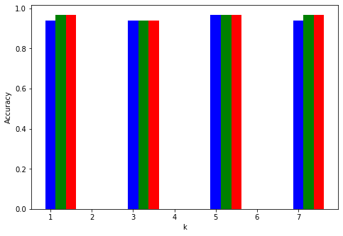

<h1 style = 'color:#4b63b8;text-align:center'>K Nearest Neighbors Algorithm</h1>

<h3 style = 'color:#e31212'>Libraries Used</h3>


```python
import numpy as np
from sklearn import datasets
from sklearn.model_selection import train_test_split
import pandas as pd
import matplotlib.pyplot as plt
from pandas.plotting import parallel_coordinates
```

### Loading IRIS Dataset from sklearn


```python
iris = datasets.load_iris()
```

## Exploring the Dataset
* IRIS Dataset has information about <tt class="docutils literal"><span class="pre">Data</span></tt> ,<tt class="docutils literal"><span class="pre">target</span></tt>, <tt class="docutils literal"><span class="pre">target_names</span></tt>, <tt class="docutils literal"><span class="pre">DESCR</span></tt>, <tt class="docutils literal"><span class="pre">Instances</span></tt>, <tt class="docutils literal"><span class="pre">Attribute Information</span></tt> and <tt class="docutils literal"><span class="pre">Summary Statistics</span></tt>
* Information that we are going to use for this classifier is <tt class="docutils literal"><span class="pre">Attribute Information</span></tt>,<tt class="docutils literal"><span class="pre"> target</span></tt>,<tt class="docutils literal"><span class="pre"> Summary Statistics</span></tt>:

    * **<tt class="docutils literal"><span class="pre">Attribute Information</span></tt>**: In this we have features like sepal length, sepal width, petal length, petal width.
    
    * **<tt class="docutils literal"><span class="pre">Target</span></tt>**: This gives us information about which the class the set of features belongs to.
    
    * **<tt class="docutils literal"><span class="pre">Summary Statistics</span></tt>**: In this we have Mean(μ), Standard deviation(σ), Min and Max value for each feature and Class Correlation.

## Target
* In this dataset we have set of features that belong to 3 classes.


```python
iris['target']
```


    array([0, 0, 0, 0, 0, 0, 0, 0, 0, 0, 0, 0, 0, 0, 0, 0, 0, 0, 0, 0, 0, 0,
           0, 0, 0, 0, 0, 0, 0, 0, 0, 0, 0, 0, 0, 0, 0, 0, 0, 0, 0, 0, 0, 0,
           0, 0, 0, 0, 0, 0, 1, 1, 1, 1, 1, 1, 1, 1, 1, 1, 1, 1, 1, 1, 1, 1,
           1, 1, 1, 1, 1, 1, 1, 1, 1, 1, 1, 1, 1, 1, 1, 1, 1, 1, 1, 1, 1, 1,
           1, 1, 1, 1, 1, 1, 1, 1, 1, 1, 1, 1, 2, 2, 2, 2, 2, 2, 2, 2, 2, 2,
           2, 2, 2, 2, 2, 2, 2, 2, 2, 2, 2, 2, 2, 2, 2, 2, 2, 2, 2, 2, 2, 2,
           2, 2, 2, 2, 2, 2, 2, 2, 2, 2, 2, 2, 2, 2, 2, 2, 2, 2])


## Target_names
* Set of features that belong to class 0 comes under Iris-setosa.
* Set of features that belong to class 1 comes under Iris-versicolor.
* Set of features that belong to class 2 comes under Iris-virginica.


```python
iris['target_names']
```


    array(['setosa', 'versicolor', 'virginica'], dtype='<U10')


## Parallel Coordinates:
> * Visualizing the IRIS Dataset using Parallel Coordinates


```python
iris_dataframe = pd.DataFrame(iris['data'], columns = ['sepal length', 'sepal width', 'petal length', 'petal width'])
iris_dataframe['target_class'] = iris['target']
iris_dataframe['target_names'] = ""
iris_dataframe.loc[iris_dataframe['target_class'] == 0, 'target_names'] = 'setosa'
iris_dataframe.loc[iris_dataframe['target_class'] == 1, 'target_names'] = 'versicolor'
iris_dataframe.loc[iris_dataframe['target_class'] == 2, 'target_names'] = 'virginica'
parallel_coordinates(iris_dataframe, 'target_names')
```


    <matplotlib.axes._subplots.AxesSubplot at 0x14955668f48>





## Box Plot:
> * Visualizing IRIS Dataset using Box Plot


```python
iris_dataframe[['sepal length', 'sepal width', 'petal length', 'petal width']].boxplot()
```


    <matplotlib.axes._subplots.AxesSubplot at 0x14958de7808>





## Creating an Iris DataFrame
* Using all the features and class values as columns we create a DataFrame 


```python
iris_df = pd.DataFrame(iris['data'], columns = ['sepal length', 'sepal width', 'petal length', 'petal width'])
iris_df['target_class'] = iris['target']
iris_df['Sample_ID'] = range(0, len(iris_df))
iris_df = iris_df.reindex(columns=['Sample_ID','sepal length', 'sepal width', 'petal length', 'petal width','target_class'])
iris_df.head(10)
```


<div>
<style scoped>
    .dataframe tbody tr th:only-of-type {
        vertical-align: middle;
    }

    .dataframe tbody tr th {
        vertical-align: top;
    }
    
    .dataframe thead th {
        text-align: right;
    }
</style>
<table border="1" class="dataframe">
  <thead>
    <tr style="text-align: right;">
      <th></th>
      <th>Sample_ID</th>
      <th>sepal length</th>
      <th>sepal width</th>
      <th>petal length</th>
      <th>petal width</th>
      <th>target_class</th>
    </tr>
  </thead>
  <tbody>
    <tr>
      <th>0</th>
      <td>0</td>
      <td>5.1</td>
      <td>3.5</td>
      <td>1.4</td>
      <td>0.2</td>
      <td>0</td>
    </tr>
    <tr>
      <th>1</th>
      <td>1</td>
      <td>4.9</td>
      <td>3.0</td>
      <td>1.4</td>
      <td>0.2</td>
      <td>0</td>
    </tr>
    <tr>
      <th>2</th>
      <td>2</td>
      <td>4.7</td>
      <td>3.2</td>
      <td>1.3</td>
      <td>0.2</td>
      <td>0</td>
    </tr>
    <tr>
      <th>3</th>
      <td>3</td>
      <td>4.6</td>
      <td>3.1</td>
      <td>1.5</td>
      <td>0.2</td>
      <td>0</td>
    </tr>
    <tr>
      <th>4</th>
      <td>4</td>
      <td>5.0</td>
      <td>3.6</td>
      <td>1.4</td>
      <td>0.2</td>
      <td>0</td>
    </tr>
    <tr>
      <th>5</th>
      <td>5</td>
      <td>5.4</td>
      <td>3.9</td>
      <td>1.7</td>
      <td>0.4</td>
      <td>0</td>
    </tr>
    <tr>
      <th>6</th>
      <td>6</td>
      <td>4.6</td>
      <td>3.4</td>
      <td>1.4</td>
      <td>0.3</td>
      <td>0</td>
    </tr>
    <tr>
      <th>7</th>
      <td>7</td>
      <td>5.0</td>
      <td>3.4</td>
      <td>1.5</td>
      <td>0.2</td>
      <td>0</td>
    </tr>
    <tr>
      <th>8</th>
      <td>8</td>
      <td>4.4</td>
      <td>2.9</td>
      <td>1.4</td>
      <td>0.2</td>
      <td>0</td>
    </tr>
    <tr>
      <th>9</th>
      <td>9</td>
      <td>4.9</td>
      <td>3.1</td>
      <td>1.5</td>
      <td>0.1</td>
      <td>0</td>
    </tr>
  </tbody>
</table>
</div>


## Shape of the DataFrame
* The shape of the DataFrame is 150 x 6 where 150 is number of data samples and 6 is 5 Attribute Information plus Class values and 1 is Sample ID


```python
iris_df.shape
```


    (150, 6)


## Data Samples per Class
* We can see that Data Samples are equally distributed among all the classes. There are 50 Samples per Class


```python
print("Number of samples for Class 0:",len(iris_df[iris_df.target_class == 0]))
print("Number of samples for Class 1:",len(iris_df[iris_df.target_class == 1]))
print("Number of samples for Class 2:",len(iris_df[iris_df.target_class == 2]))
```

    Number of samples for Class 0: 50
    Number of samples for Class 1: 50
    Number of samples for Class 2: 50


## Summary of all Attributes:


```python
iris_df.describe(include = 'all')
```


<div>
<style scoped>
    .dataframe tbody tr th:only-of-type {
        vertical-align: middle;
    }

    .dataframe tbody tr th {
        vertical-align: top;
    }
    
    .dataframe thead th {
        text-align: right;
    }
</style>
<table border="1" class="dataframe">
  <thead>
    <tr style="text-align: right;">
      <th></th>
      <th>Sample_ID</th>
      <th>sepal length</th>
      <th>sepal width</th>
      <th>petal length</th>
      <th>petal width</th>
      <th>target_class</th>
    </tr>
  </thead>
  <tbody>
    <tr>
      <th>count</th>
      <td>150.000000</td>
      <td>150.000000</td>
      <td>150.000000</td>
      <td>150.000000</td>
      <td>150.000000</td>
      <td>150.000000</td>
    </tr>
    <tr>
      <th>mean</th>
      <td>74.500000</td>
      <td>5.843333</td>
      <td>3.057333</td>
      <td>3.758000</td>
      <td>1.199333</td>
      <td>1.000000</td>
    </tr>
    <tr>
      <th>std</th>
      <td>43.445368</td>
      <td>0.828066</td>
      <td>0.435866</td>
      <td>1.765298</td>
      <td>0.762238</td>
      <td>0.819232</td>
    </tr>
    <tr>
      <th>min</th>
      <td>0.000000</td>
      <td>4.300000</td>
      <td>2.000000</td>
      <td>1.000000</td>
      <td>0.100000</td>
      <td>0.000000</td>
    </tr>
    <tr>
      <th>25%</th>
      <td>37.250000</td>
      <td>5.100000</td>
      <td>2.800000</td>
      <td>1.600000</td>
      <td>0.300000</td>
      <td>0.000000</td>
    </tr>
    <tr>
      <th>50%</th>
      <td>74.500000</td>
      <td>5.800000</td>
      <td>3.000000</td>
      <td>4.350000</td>
      <td>1.300000</td>
      <td>1.000000</td>
    </tr>
    <tr>
      <th>75%</th>
      <td>111.750000</td>
      <td>6.400000</td>
      <td>3.300000</td>
      <td>5.100000</td>
      <td>1.800000</td>
      <td>2.000000</td>
    </tr>
    <tr>
      <th>max</th>
      <td>149.000000</td>
      <td>7.900000</td>
      <td>4.400000</td>
      <td>6.900000</td>
      <td>2.500000</td>
      <td>2.000000</td>
    </tr>
  </tbody>
</table>
</div>


```python
feature_min_val = np.amin(iris_df.to_numpy()[:, 1:5], axis=0).reshape(-1,1)
feature_max_val = np.amax(iris_df.to_numpy()[:, 1:5], axis=0).reshape(-1,1)
```

## Splitting the IRIS Dataset
* We split the Data into Train, Dev and Test
* Below are the split percentages
    * Train size is 40%
    * Dev size is 30%
    * Test size is 30%


```python
rest, X_test = train_test_split(iris_df.to_numpy(), test_size = 0.3,shuffle= True)
```


```python
X_train, X_dev = train_test_split(rest, test_size = 0.3)
```

## Normalizing the Dataset
* This function normalizes the Dataset, after the normalizing all the feature values are in (0,1)

* While Normalizing we use Summary Statistics Information like x-min and x-max for each feature
  
     


```python
def normalized_dataset(mini,maxi,dataset):
    dataset_copy = np.copy(dataset)
#     x_min = np.amin(dataset_copy[:, 1:5], axis=0).reshape(-1,1)
    x_min = mini
#     x_max = np.amax(dataset_copy[:, 1:5], axis=0).reshape(-1,1)
    x_max = maxi
    numerator_diff = dataset_copy.T[1:5, :] - x_min
    denominator_diff = x_max - x_min
    dataset_copy.T[1:5, :] = numerator_diff / denominator_diff
    return dataset_copy  
```

# KNearestNeighbors Class
* Below are the different methods that are used to calculate the Nearest Neighbors
    * Distance Metric
        * Euclidean Distance
        * Cosine Similarity
        * Normalized Euclidean Distance
    * Number of Neighbors calculation
    * Class prediction
    * Accuracy Calculation

## Distance Metric
* <strong>calculate_euclidean_distance:</strong> 
> 1. In this method we are calculating the euclidean distance between the test row and the whole dataset and the return values are list of tuples with data row and the respective distance to the test row 
>
> 2. Formula for calculating euclidean distance is given as
> 
>    
> 3. I have used the concept of <strong>*Vectorization*</strong> to calculate the distance. <strong>*Vectorization*</strong> is used to make the calculation process speed up without using any loop
>
> 4. First we take the Dev data and transpose the dataset, So now we have dataset in the form of the shape [features, samples] and we transpose the test row and its shape will be [features, one_sample].
>
> 5. For better visualization purpose, let us consider first 4 rows of IRIS data as Train data and 5th row as Dev row
>
> 6. Below is the transposed Train and dev data.
>   
>     
> 
> 
> 7. The above calculation is possible because of <strong>*Brodcasting*</strong> in numpy. The below figure illustrates <strong>*Brodcasting*</strong> clearly.
>                                               
> <strong>Note</strong>: The significance of <strong>*Vectorization*</strong> is evident when the dataset is considerably large. This concept helps us to calculate the distance in just one go

* <strong>calculate_cosine_similarity:</strong>
> 1. In this method we calculate the cosine similarity between the test row nad whole dataset and the return values are list of tuples with data row and respective similarity with the test row

  2. The calculations for this distance metric are also done with <strong>*Vectorization*</strong> as stated above
  
  3. Formula for calculating Cosine Similarity is given as
     
      ​																	 
     ​     
     <br/>
     
  4. First I have calculated and then I have calculated the  and finally used <strong>*Dot Product*</strong> to get the similarity

  5. As dev and train data are normalized according to their respective features, for visualization given below is how the product looks like 

        <br/>

  6. In a similar fashion we get Cosine similarity of the complete dataset in one go


* <strong>Normalized Euclidean Distance:</strong>
> * It is just calculating Euclidean distance with Normalized Dataset.

## Number of Neighbors Calculation
* <strong>calculate_num_neigh:</strong>
> 1. This method takes in dev row and train data as parameters and returns top k Neighbors to the dev row
> 2. According to the distance metric, this method gets the calculated respective distance in which we have train rows and their respective distance or similarity w.r.t dev row
> 3. If we consider Euclidean distance, two vectors are said to be similar if the Euclidean distance between them is less. If we consider Cosine Similarity, two vectors are said to similar if their similarity is more
> 4. So based on that the <strong>*dist*</strong> which is a list of tuples, it is sorted in ascending order for Euclidean Distance and in descending order for Cosine Similarity
> 5. Now we return top k Neighbors list 

## Class Prediction
* <strong>class_prediction:</strong>
> 1. In this method, we get the number of neighbors list from calculate_num_neigh method
> 2. Now we extract the classes of all the neighbors list we have got, then we take the majority of the class in that list and state that as our prediction

## Accuracy Prediction
* <strong>accuracy_prediction:</strong>
> * Here we get a class prediction from the above method and in this method we check whether the predicted class is same as target class.
    * If it is same we increase correct count by 1
    * Else correct count is 0
  * In this way we get the correct count for the complete dataset then we calculate the accuracy for various neighbors


```python
class KNearestNeighbors(object):
    def __init__(self, num_neighbors, distance_metric):
        self.num_neighbors = num_neighbors
        self.distance_metric = distance_metric
        
    def calculate_euclidean_distance(self,test_row, dev_data):  
        test_vector = test_row[1:5].reshape(-1,1)
        dev_vectors = dev_data.T[1:5, :]
        distance = np.sqrt(np.sum(np.square(dev_vectors - test_vector), axis=0))
        distances_list = [(dev_data[i].tolist(), distance[i]) for i in range(len(distance))]
        return distances_list
    
    def calculate_cosine_similarity(self, test_row, dev_data):
        test_vector = test_row[1:5]
        dev_vectors = dev_data.T[1:5, :]
        test_vector_norm = test_vector / np.linalg.norm(test_vector)
        dev_vectors_norm = dev_vectors / np.linalg.norm(dev_vectors, axis=0)
        cosine_similiarity = np.dot(test_vector_norm,dev_vectors_norm)
        similarity_list = [(dev_data[i].tolist(), cosine_similiarity[i]) for i in range(len(cosine_similiarity))]
        return similarity_list
          
    def calculate_num_neigh(self,test_row, dev_data):
        if self.distance_metric == 'Euclidean':
            dist = self.calculate_euclidean_distance(test_row, dev_data)
            dist.sort(key=lambda X:X[1])
        elif self.distance_metric == 'Cosine Similarity':
            dist = self.calculate_cosine_similarity(test_row, dev_data)
            dist.sort(key=lambda X:X[1], reverse = True)
        num_neigh_list =[]
        for i in range(self.num_neighbors):
#             if dist[i][0][0] != test_row[0]:
            num_neigh_list.append(dist[i])
        return num_neigh_list
    
    def class_prediction(self,test_row, dev_data):
        num_neigh_list = self.calculate_num_neigh(test_row, dev_data)
        class_list = [num_neigh_list[i][0][5] for i in range(len(num_neigh_list))]
        predicted_class = max(set(class_list), key=class_list.count)
        return predicted_class
    
    def accuracy_prediction(self,test_row, dev_data):
        predicted_class = self.class_prediction(test_row, dev_data)
        correct_count = 0.0
        if predicted_class != test_row[5]:
            return correct_count
        else:
            correct_count += 1
            return correct_count
```

## K value Tuning:
> * We tune the k value till 7 and calculate the accuracy for various Distance Metrics


```python
num_neigh_list = [1,3,5,7]
```

## Calculating Accuracy using Euclidean Distance for neighbors [1, 3, 5, 7]


```python
euclidean_accuracy_list = list()
for i in range(len(num_neigh_list)):
    correct_count = 0.0
    knn = KNearestNeighbors(num_neighbors=num_neigh_list[i], distance_metric= 'Euclidean')
    for j in range(len(X_dev)):
        correct_count += knn.accuracy_prediction(X_dev[j],X_train)
    accuracy = correct_count/len(X_dev)
    euclidean_accuracy_list.append([num_neigh_list[i], accuracy])

```

### Accuracies for Euclidean distance


```python
euclid_acc_df = pd.DataFrame(euclidean_accuracy_list, columns=['k', 'Euclidean Accuracy'])
euclid_acc_df.head()
```


<div>
<style scoped>
    .dataframe tbody tr th:only-of-type {
        vertical-align: middle;
    }

    .dataframe tbody tr th {
        vertical-align: top;
    }
    
    .dataframe thead th {
        text-align: right;
    }
</style>
<table border="1" class="dataframe">
  <thead>
    <tr style="text-align: right;">
      <th></th>
      <th>k</th>
      <th>Euclidean Accuracy</th>
    </tr>
  </thead>
  <tbody>
    <tr>
      <th>0</th>
      <td>1</td>
      <td>0.93750</td>
    </tr>
    <tr>
      <th>1</th>
      <td>3</td>
      <td>0.93750</td>
    </tr>
    <tr>
      <th>2</th>
      <td>5</td>
      <td>0.96875</td>
    </tr>
    <tr>
      <th>3</th>
      <td>7</td>
      <td>0.93750</td>
    </tr>
  </tbody>
</table>
</div>


## Calculating Accuracy using Cosine Similarity for neighbors [1, 3, 5, 7]


```python
cosine_sim_accuracy_list = list()
for i in range(len(num_neigh_list)):
    correct_count = 0.0
    knn = KNearestNeighbors(num_neighbors=num_neigh_list[i], distance_metric= 'Cosine Similarity')
    for j in range(len(X_dev)):
        correct_count += knn.accuracy_prediction(X_dev[j],X_train)
    accuracy = correct_count/len(X_dev)
    cosine_sim_accuracy_list.append([num_neigh_list[i], accuracy])

```

### Accuracies for Cosine Similarity


```python
cosine_acc_df = pd.DataFrame(cosine_sim_accuracy_list, columns=['k', 'Cosine Accuracy'])
cosine_acc_df.head()
```


<div>
<style scoped>
    .dataframe tbody tr th:only-of-type {
        vertical-align: middle;
    }

    .dataframe tbody tr th {
        vertical-align: top;
    }
    
    .dataframe thead th {
        text-align: right;
    }
</style>
<table border="1" class="dataframe">
  <thead>
    <tr style="text-align: right;">
      <th></th>
      <th>k</th>
      <th>Cosine Accuracy</th>
    </tr>
  </thead>
  <tbody>
    <tr>
      <th>0</th>
      <td>1</td>
      <td>0.96875</td>
    </tr>
    <tr>
      <th>1</th>
      <td>3</td>
      <td>0.93750</td>
    </tr>
    <tr>
      <th>2</th>
      <td>5</td>
      <td>0.96875</td>
    </tr>
    <tr>
      <th>3</th>
      <td>7</td>
      <td>0.96875</td>
    </tr>
  </tbody>
</table>
</div>


## Calculating Accuracy using Normalized Euclidean Distance for neighbors [1, 3, 5, 7]


```python
normalized_euclid_accuracy_list = list()
X_dev_norm = normalized_dataset(feature_min_val,feature_max_val,X_dev)
X_train_norm = normalized_dataset(feature_min_val,feature_max_val,X_train)
for i in range(len(num_neigh_list)):
    correct_count = 0.0
    knn = KNearestNeighbors(num_neighbors=num_neigh_list[i], distance_metric= 'Euclidean')
    for j in range(len(X_dev_norm)):
        correct_count += knn.accuracy_prediction(X_dev_norm[j],X_train_norm)
    accuracy = correct_count/len(X_dev_norm)
    normalized_euclid_accuracy_list.append([num_neigh_list[i], accuracy])
```

### Accuracies for Normalized Euclidean distance


```python
normalized_euclid_acc_df = pd.DataFrame(normalized_euclid_accuracy_list, columns=['k', 'Normalised Accuracy'])
normalized_euclid_acc_df.head()
```


<div>
<style scoped>
    .dataframe tbody tr th:only-of-type {
        vertical-align: middle;
    }

    .dataframe tbody tr th {
        vertical-align: top;
    }
    
    .dataframe thead th {
        text-align: right;
    }
</style>
<table border="1" class="dataframe">
  <thead>
    <tr style="text-align: right;">
      <th></th>
      <th>k</th>
      <th>Normalised Accuracy</th>
    </tr>
  </thead>
  <tbody>
    <tr>
      <th>0</th>
      <td>1</td>
      <td>0.96875</td>
    </tr>
    <tr>
      <th>1</th>
      <td>3</td>
      <td>0.93750</td>
    </tr>
    <tr>
      <th>2</th>
      <td>5</td>
      <td>0.96875</td>
    </tr>
    <tr>
      <th>3</th>
      <td>7</td>
      <td>0.96875</td>
    </tr>
  </tbody>
</table>
</div>


```python
euclidean_acc_arr = np.array(euclidean_accuracy_list)
cosine_acc_arr = np.array(cosine_sim_accuracy_list)
normalised_acc_arr = np.array(normalized_euclid_accuracy_list)
```

## Plotting Accuracies for all k values with respective Distance Metrics
> * <h3 style = 'color:#0b1cd9'>Euclidean Distance</h3>
> * <h3 style = 'color:#058728'>Cosine Similarity</h3>
> * <h3 style = 'color:#e31212'>Normalized Euclidean Distance</h3>


```python
fig = plt.figure()
ax = fig.add_axes([0,0,1,1])
for i in range(4):
    ax.bar(int(euclidean_acc_arr[:,:1][i]) + 0.0, float(euclidean_acc_arr[:,1:2][i]), color = 'b', width = 0.25 )
    ax.bar(int(cosine_acc_arr[:,:1][i]) + 0.25, float(cosine_acc_arr[:,1:2][i]), color = 'g', width = 0.25)
    ax.bar(int(normalised_acc_arr[:,:1][i]) + 0.5, float(normalised_acc_arr[:,1:2][i]), color = 'r', width = 0.25)

plt.xlabel('k')
plt.ylabel('Accuracy')

```


    Text(0, 0.5, 'Accuracy')





## Choosing the best Model:
* <strong>choose_best_model:</strong>
    > 1. This method takes in all the accuracy lists by different distance metrics and calculates which model performed well on the dev set
    > 2. Based on that it returns the respective distance metric, neighbors and accuracy, so that we can use these parameters and calculate the accuracy on test set


```python
def choose_best_model(euc_acc, cos_acc, norm_acc):
    euc_acc.sort(key=lambda X:X[1], reverse = True)
    cos_acc.sort(key=lambda X:X[1], reverse = True)
    norm_acc.sort(key=lambda X:X[1], reverse = True)
    accuracy_dict = dict()
    accuracy_dict['Euclidean'] = euc_acc[0]
    accuracy_dict['Cosine Similarity'] = cos_acc[0]
    accuracy_dict['Normalized Euclidean'] = norm_acc[0]
    sorted_items =sorted(accuracy_dict.items(), key=lambda x: x[1][1], reverse =True)
    distance_metric = sorted_items[0][0]
    num_neigh = sorted_items[0][1][0]
    final_acc = sorted_items[0][1][1]
    return distance_metric, num_neigh, final_acc
```

## Based on the performance on the Dev set, below are the optimal hyperparameters


```python
distance, num_neigh, acc = choose_best_model(euclidean_accuracy_list, cosine_sim_accuracy_list,normalized_euclid_accuracy_list)
print("My model based on Dev set accuracy is {}, with k= {} and accuracy= {} %".format(distance, num_neigh, acc*100))
```

    My model based on Dev set accuracy is Euclidean, with k= 5 and accuracy= 96.875 %


## Using the optimal hyperparameters, below is the performance on Test set


```python
if distance != 'Normalized Euclidean':
    correct_count = 0.0
    knn = KNearestNeighbors(num_neighbors=num_neigh, distance_metric= distance)
    for j in range(len(X_test)):
        correct_count += knn.accuracy_prediction(X_test[j],X_train)
    accuracy = correct_count/len(X_test)
    print("Accuracy using {} with k = {} is {} %".format(distance, num_neigh,100*accuracy) )
else:
    X_test_norm = normalized_dataset(feature_min_val,feature_max_val,X_test)
    X_train_norm = normalized_dataset(feature_min_val,feature_max_val,X_train)
    correct_count = 0.0
    knn = KNearestNeighbors(num_neighbors=num_neigh, distance_metric= 'Euclidean')
    for j in range(len(X_test_norm)):
        correct_count += knn.accuracy_prediction(X_test_norm[j],X_train_norm)
    accuracy = correct_count/len(X_test_norm)
    print("Accuracy using {} with k = {} is {} %".format('Normalize Euclidean', num_neigh,100*accuracy) )
```

    Accuracy using Euclidean with k = 5 is 97.77777777777777 %


## References:
> * https://machinelearningmastery.com/tutorial-to-implement-k-nearest-neighbors-in-python-from-scratch/
> * https://github.com/python-engineer/MLfromscratch/blob/master/mlfromscratch/knn.py
> * https://www.tutorialspoint.com/matplotlib/matplotlib_bar_plot.htm
> * https://ljvmiranda921.github.io/notebook/2017/02/09/k-nearest-neighbors/
> * https://stackoverflow.com/questions/613183/how-do-i-sort-a-dictionary-by-value
